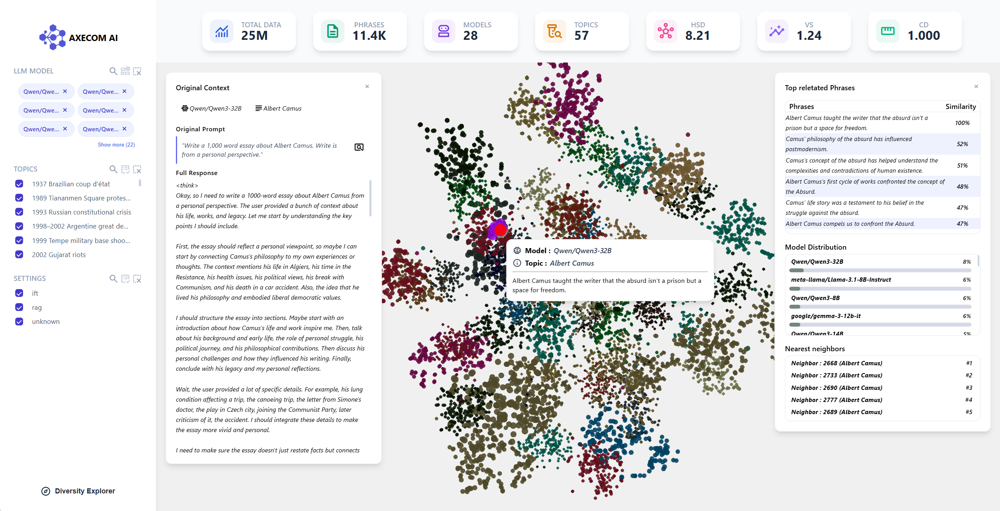

<!-- Improved compatibility of back to top link: See: https://github.com/othneildrew/Best-README-Template/pull/73 -->
<a id="readme-top"></a>

[![Contributors][contributors-shield]][contributors-url]
[![Forks][forks-shield]][forks-url]
[![Stargazers][stars-shield]][stars-url]
[![Issues][issues-shield]][issues-url]
[![project_license][license-shield]][license-url]
[![LinkedIn][linkedin-shield]][linkedin-url]


<!-- PROJECT LOGO -->
<br />
<div align="center">
  <a href="https://github.com/Andres98200/galaxy-explorer">
    
  </a>

<h3 align="center">AXECOM AI -Galaxy Explorer</h3>

  <p align="center">
    A high-performance web application designed for exploring and visualizing large-scale vector embeddings and language datasets in real time
    <br />
    <a href="http://10.92.0.161/"><strong>View Live Demo (AAU Network / VPN Required)</strong></a>    
    <br />
    <br />
    &middot;
    <a href="https://github.com/Andres98200/galaxy-explorer/issues/new?labels=bug&template=bug-report---.md">Report Bug</a>
    &middot;
    <a href="https://github.com/Andres98200/galaxy-explorer/issues/new?labels=enhancement&template=feature-request---.md">Request Feature</a>
  </p>
</div>


<!-- TABLE OF CONTENTS -->
<details>
  <summary>Table of Contents</summary>
  <ol>
    <li>
      <a href="#about-the-project">About The Project</a>
      <ul>
        <li><a href="#built-with">Built With</a></li>
      </ul>
    </li>
    <li>
      <a href="#getting-started">Getting Started</a>
      <ul>
        <li><a href="#prerequisites">Prerequisites</a></li>
        <li><a href="#installation">Installation</a></li>
      </ul>
    </li>
    <li><a href="#Data-Persistance-Regeneration">Data Persistance & Regeneration</a></li>
    <li><a href="#cicd-pipeline">CI/CD Pipeline</a></li>
    <li><a href="#contributing">Contributing</a></li>
    <li><a href="#license">License</a></li>
    <li><a href="#contact">Contact</a></li>
  </ol>
</details>


<!-- ABOUT THE PROJECT -->
## About The Project

**AXECOM AI - Galaxy Explorer** is built to process and render large-scale vector datasets efficiently. Deployed on an Aalborg University (AAU) OpenStack GPU instance (`AAU.GPU.T4-2`), it seamlessly handles **70M data points** and **k sentences** backed by a highly optimized SQLite architecture.




Key Infrastructure Highlights:
* Fully containerized environment via **Docker Compose**.
* Reverse-proxied via **Nginx** to eliminate CORS issues between frontend and backend services.
* Persistent, high-performance database indexing.

<p align="right">(<a href="#readme-top">back to top</a>)</p>


## Architecture Overview

The application is fully containerized using Docker and Docker Compose:

* **Frontend:** React / Next.js served via Nginx (Port `80`). Acts as a reverse proxy routing API traffic to the backend to eliminate CORS issues.
* **Backend:** FastAPI (Python) serving vector queries and dataset processing endpoints (Port `8000`).
* **Database:** Embedded SQLite database (`galaxy_explorer.db`) optimized with custom indexing, mounted via Docker bind volume for data persistence.
* **Data:** Source dataset is hosted on [Hugging Face](https://huggingface.co/datasets/dwright37/llm-knowledge-collapse).

### Built With

* [![React][React.js]][React-url]
* [![FastAPI][FastAPI]][FastAPI-url]
* [![Python][Python]][Python-url]
* [![SQLite][SQLite]][SQLite-url]
* [![Docker][Docker]][Docker-url]
* [![Nginx][Nginx]][Nginx-url]
* [![HuggingFace][HuggingFace]][HuggingFace-url]


<p align="right">(<a href="#readme-top">back to top</a>)</p>


<!-- GETTING STARTED -->
## Getting Started

Follow these steps to deploy or run a copy of the project locally or on your OpenStack VM instance.

### Prerequisites

* **Docker** & **Docker Compose** installed on your system 
  ```sh
  sudo apt-get update
  sudo apt-get install docker-ce docker-ce-cli containerd.io docker-buildx-plugin docker-compose-plugin
  ```

### Installation

1. Clone the repo
   ```sh
    git clone https://github.com/Andres98200/galaxy-explorer.git
    cd galaxy_explorer
    ```
2. Build and start the Docker containers in detached mode:
   ```sh
   docker compose up -d --build
   ```
3. Access the application in your browser at : http://10.92.0.161/ or http://localhost/ (on the AAU network).
   

<p align="right">(<a href="#readme-top">back to top</a>)</p>


<!-- USAGE EXAMPLES -->
## Data Persistence & Regeneration

The SQLite database file is persisted on the host machine using a Docker bind mount at `./backend/data/galaxy_explorer.db.`

To reset or regenerate the dataset :

1. Stop the containers :
```sh
  docker compose down
```

2. Remove the .db file : 
```sh
  rm backend/galaxy_explorer.db
```

3. Restart the containers: 
```sh
  docker compose up -d
```

4. The backend script will automatically detect the missing database and populate it on startup. You can check the logs to see the evolution of the data loading and processing : 
```sh
  docker compose logs -f backend
```

<p align="right">(<a href="#readme-top">back to top</a>)</p>


<!-- ROADMAP -->
## CI/CD Pipeline

Continuous Integration and Deployment are managed via GitHub Actions and a **GitHub Self-Hosted Runner** hosted directly on the OpenStack GPU VM.

* **Branch Protection & Quality Gate:**
  * Direct pushes to the `main` branch are restricted/protected.
  * Commits and Pull Requests targeting both `dev` and `main` branches branches automatically trigger `.github/workflows/CI.yml`.
  * The CI workflow validates that all commit messages strictly adhere to the **Conventional Commits** specification (e.g., `feat:`, `fix:`, `docs:`, `refactor:`) to maintain a clean git history and ensure build integrity.

* **Continuous Deployment (CD):**
  * Merges or pushes to the `main` branch trigger the automated deployment pipeline (`.github/workflows/deploy.yml`).
  * The self-hosted runner pulls the latest changes and executes `docker compose up -d --build` automatically, ensuring zero-downtime updates without manual SSH intervention.

<p align="right">(<a href="#readme-top">back to top</a>)</p>


<!-- CONTRIBUTING -->
### Top contributors:


<a href="https://github.com/Andres98200/galaxy-explorer/graphs/contributors">
  
</a>

<p align="right">(<a href="#readme-top">back to top</a>)</p>


<!-- MARKDOWN LINKS & IMAGES -->
<!-- https://www.markdownguide.org/basic-syntax/#reference-style-links -->
[contributors-shield]: https://img.shields.io/github/contributors/Andres98200/galaxy-explorer.svg?style=for-the-badge
[contributors-url]: https://github.com/Andres98200/galaxy-explorer/graphs/contributors
[forks-shield]: https://img.shields.io/github/forks/Andres98200/galaxy-explorer.svg?style=for-the-badge
[forks-url]: https://github.com/Andres98200/galaxy-explorer/network/members
[stars-shield]: https://img.shields.io/github/stars/Andres98200/galaxy-explorer.svg?style=for-the-badge
[stars-url]: https://github.com/Andres98200/galaxy-explorer/stargazers
[issues-shield]: https://img.shields.io/github/issues/Andres98200/galaxy-explorer.svg?style=for-the-badge
[issues-url]: https://github.com/Andres98200/galaxy-explorer/issues
[license-shield]: https://img.shields.io/github/license/Andres98200/galaxy-explorer.svg?style=for-the-badge
[license-url]: https://github.com/Andres98200/galaxy-explorer/blob/main/LICENSE
[linkedin-shield]: https://img.shields.io/badge/-LinkedIn-black.svg?style=for-the-badge&logo=linkedin&colorB=555
[linkedin-url]: https://www.linkedin.com/in/andres-felipe-torres-05ba26214/
[product-screenshot]: frontend/public/image.png
<!-- Shields.io badges. You can a comprehensive list with many more badges at: https://github.com/inttter/md-badges -->
[React.js]: https://img.shields.io/badge/React-20232A?style=for-the-badge&logo=react&logoColor=61DAFB
[React-url]: https://reactjs.org/
[FastAPI]: https://img.shields.io/badge/FastAPI-005571?style=for-the-badge&logo=fastapi
[FastAPI-url]: https://fastapi.tiangolo.com/
[Python]: https://img.shields.io/badge/python-3670A0?style=for-the-badge&logo=python&logoColor=ffdd54
[Python-url]: https://www.python.org/
[SQLite]: https://img.shields.io/badge/SQLite-003B57?style=flat-square&logo=SQLite&logoColor=white
[SQLite-url]: https://sqlite.org/
[Docker]: https://img.shields.io/badge/docker-257bd6?style=for-the-badge&logo=docker&logoColor=white
[Docker-url]: https://www.docker.com/
[Nginx]: https://img.shields.io/badge/Nginx-009639?logo=nginx&logoColor=white&style=for-the-badge
[Nginx-url]: https://nginx.org/
[HuggingFace]: https://img.shields.io/badge/-HuggingFace-3B4252?style=flat&logo=huggingface&logoColor=
[HuggingFace-url]: https://huggingface.co/


